  

On February 29, 2020, Gov. Jay Inslee declared a State of Emergency to slow the spread of COVID-19.   
  
Washington has had one of the lowest amounts of cases and deaths per 1 million people compared to the rest of America. As of November 15, 2020 there are over 130,000 confirmed cases and 2,500 deaths in Washington.

  

  

  

  

In mid March, a statewide emergency proclamation was released to temporarily shut down nonessential businesses. Restaurants were allowed to do take-out and delivery services but no in-person dining.  
[@stumptowncoffee](https://www.instagram.com/stumptowncoffee)

  

  

  

  

As small businesses boarded up their doors and windows, Seattle-based artists painted messages of love and support.  
[@mollymoonicecream](https://www.instagram.com/mollymoonicecream/?hl=en) [@morgan\_smile](https://www.instagram.com/morgan_smile) [@morgansmile\_designs](https://www.instagram.com/morgansmile_designs)

  

  

  

  

Across this intersection are some of the murals created during this time. This rainbow crosswalks represents the LGBTQ+ community as a symbol of pride. Seattle has these spanning 11th Ave and Pike/Pine.  
  
>  "Being born gay, Black, and female is not a revolutionary act. Being proud to be gay, Black and female is." � Lena Waith during her speech at Essence's Black Women in Hollywood event.

  

  

  

  

COVID-19 most commonly spreads between people who are in close contact with one another through respiratory droplets or small particles. Avoid exposure to the virus or spreading it by practicing social distancing (6 feet apart, 2 arm lengths), wearing a mask, and washing hands.  
  
(middle) We cannot wait to see you again!  
(right) Stand six steps back and promise you love me  
  
[@oddfellowscafe](https://www.instagram.com/oddfellowscafe/?hl=en) [@stacy\_milrany\_art](https://www.instagram.com/stacy_milrany_art/)

  

  

  

  

With increased time at home, people picked up new and old hobbies to spend their time such as reading, exercising, and painting. Cooking, decluttering, learning new skills, home improvement, and gardening also grew in popularity.   
  
[@comet\_taven](https://www.instagram.com/comet_tavern/?hl=en) [@sean\_evergreen](https://www.instagram.com/sean_evergreen/)

  

  

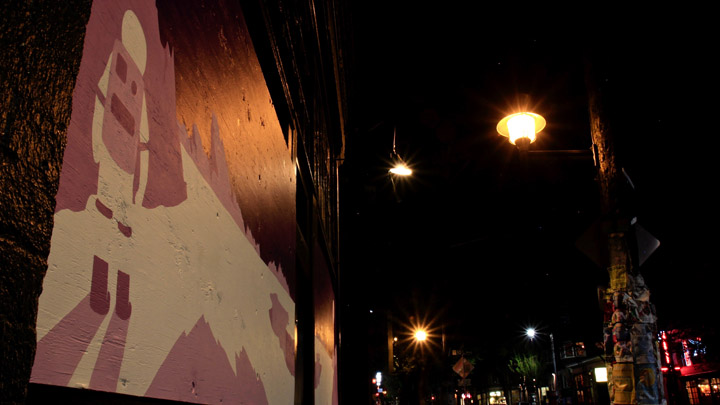  

  

Mental illness has sharply increased in 2020 and has continued to rise over the last few years. People who screened with moderate to severe symptoms of anxiety or depression noted that they were struggling most with loneliness and isolation. Rates of anxiety, depression, and suicidal ideation rates are rising amongst adults and are the highest among youth.   
[Read more on the state of mental health in America on Mental Health America.](https://www.mhanational.org/issues/state-mental-health-america)  
  
[@purebonaventure](https://www.instagram.com/purebonaventure/) [@overallcreative](https://www.instagram.com/overallcreative/) [@comet\_tavern](https://www.instagram.com/comet_tavern/)  

  

  

  

  

Mindfulness meditation is a way to help cope with stress. It has gained popularity globally with 200-500 million people practicing. The majority of people meditate to improve their overall wellbeing. Relieving anxiety and stress or improving heart health are other reasons to start practicing.   
  
Pause for a moment and focus on your breath. Without judgement, observe how you feel and what you're thinking. And let that pass.  
  
(left) It's okay to slow down \#keepsmilingseattle [@morgan\_smile](https://www.instagram.com/morgan_smile/) [@morgansmile\_designs](https://www.instagram.com/morgansmile_designs/)  
(right) Press to reboot society

  

  

  

  

Hair salons and barbers closed due to the pandemic prompting some at-home quarantine haircuts. People are also experimenting with growing a mustache, shaving their head, cutting bangs, dyeing their hair, or growing a man bun.  
[@emersonsalon](https://www.instagram.com/emersonsalon/) [@seattlecoffeeworks](https://www.instagram.com/seattlecoffeeworks/)

  

  

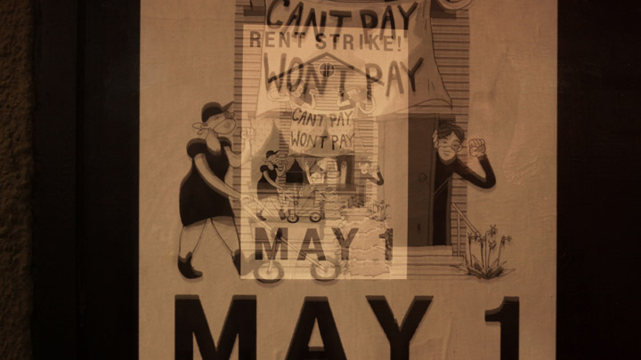  

  

May Day. The record high unemployment rates due to COVID, delays in unemployment payments, unclear eviction bans, and pending rent threaten food and shelter for many. Neighborhoods in Seattle petitioned a rent strike to put pressure on landlords and politicians for a statewide suspension of rent, mortgage, and utility payments.

  

  

  

  

Although concerts and other live performances were postponed or cancelled, live streams have risen as an alternative performance space. Viewers can engage through commenting and reacting. The artist can interact with their audience and have a human connection.   
  
Perhaps take a look at your local concert venue and see if they have any live streams coming up.  
[@neumos\_](https://www.instagram.com/neumos_/) [@therunawayseattle](https://www.instagram.com/therunawayseattle/)

  

  

  

  

In June 2020, restaurants and bars in Seattle were allowed to reopen with limited capacity and with [guidelines](https://www.theinfatuation.com/features/seattle-restaurant-reopening-rules) from the Washington Department of Health. The CDC also released its [guiding principles](https://www.cdc.gov/coronavirus/2019-ncov/community/organizations/business-employers/bars-restaurants.html) for restaurants and bars.  
  
[@morgan\_smile](https://www.instagram.com/morgan_smile/) [@morgansmile\_designs](https://www.instagram.com/morgansmile_designs/) \#keepsmilingseattle [@samstavern](https://www.instagram.com/samstavern/)

  

  

  

  

Zoom, a video conferencing service, gained popularity during the pandemic to keep up with friends and family or to have staff meetings. The interface was relatively intuitive and logins weren't required to join meetings.  
  
Throughout the pandemic many have had zoom birthdays, happy hours, and even weddings!

  

  

  

  

As we walked through Pioneer Square we encountered murals in varying stages of progress.  
  
Seattle's skyline is always changing with new construction.

  

  

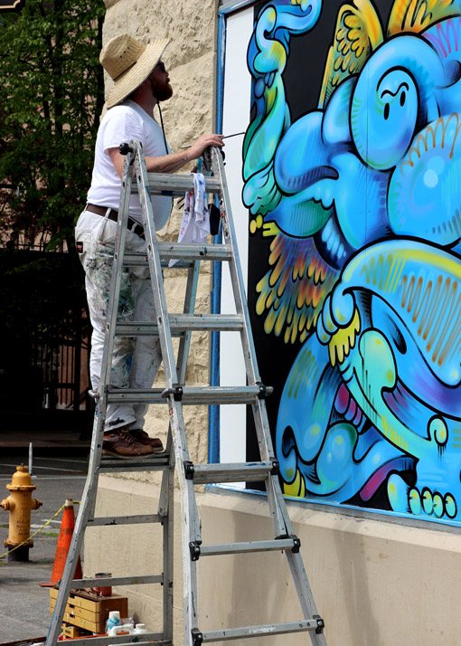  

  

Boarded up buildings have become blank canvas for local artists to fill. They brighten up the landscape of the city.

  

  

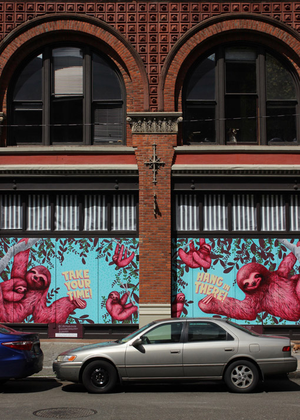  

  

"Take your time! Hang in there!", a reminder to take time and move slowly like a sloth.  
[@caseyweldon](https://www.instagram.com/caseyweldon/) [@alexanderhalladay](https://www.instagram.com/alexanderhalladay/) [@lordego1](https://www.instagram.com/lordego1/) [@creativitythatconnects](https://www.instagram.com/creativitythatconnects/)

  

  

  

  

[@caseyweldon](https://www.instagram.com/caseyweldon/) [@alexanderhalladay](https://www.instagram.com/alexanderhalladay/) [@lordego1](https://www.instagram.com/lordego1/) [@creativitythatconnects](https://www.instagram.com/creativitythatconnects/)

  

  

  

  

Emergency Medical Services (EMS), 911, health care workers, and other public safety professionals play a vital role in the response to COVID-19 on the frontlines.  
[@wakudastudio](https://www.instagram.com/wakudastudio/)

  

  

  

  

[@wakudastudio](https://www.instagram.com/wakudastudio/)  

  

  

  

  

This is temporary.  
[@b\_line\_dot](https://www.instagram.com/b_line_dot/)

  

  

  

  

>  _My wife�s the reason anything gets done  
> She nudges me towards promise by degrees  
> She is a perfect symphony of one  
> Our son is her most beautiful reprise.  
> We chase the melodies that seem to find us  
> Until they�re finished songs and start to play  
> When senseless acts of tragedy remind us  
> That nothing here is promised, not one day.  
> This show is proof that history remembers  
> We lived through times when hate and fear seemed stronger;  
> We rise and fall and light from dying embers, remembrances that hope and love last longer  
> And love is love is love is love is love is love is love is love cannot be killed or swept aside.  
> I sing Vanessa�s symphony, Eliza tells her story  
> Now fill the world with music, love and pride._  
>   
> Love Sonnet by Lin-Manuel Miranda at the Tony Awards 2016 as he accepted his award for Best Score with Hamilton.  
[@b\_line\_dot](https://www.instagram.com/b_line_dot/)

  

  

  

  

One World: Together at Home was a series of benefit concerts artists held over Instagram Live in their own home. It was held in support of the World Health Organization and to promote social distancing while gathering together for a live chill concert. \#TogetherAtHome

  

  

  

  

Independent book stores closed their doors as COVID-19 forced non-essential businesses to close. Readers have shifted online for books and looked for ways to support their local bookstores.  
  
"A book is a dream that you hold in your hands" quote by Neil Gaiman  
[@purebonaventure](https://www.instagram.com/purebonaventure/)

  

  

  

  

  

  

  

  

"If you can't go through an obstacle, go around it. Water does." � Margaret Atwood, The Penelopiad.  
  
In our emergent reality, complexity and uncertainty are ever flowing. With this in mind, everyone has agency and can respond with agility.  
[@erinelisabeth](https://www.instagram.com/erinelisabeth/) [@erinoostra](https://www.instagram.com/erinoostra/) [@pioneersquare](https://www.instagram.com/pioneersquare/)

  

  

  

  

We stopped by this mural while it was in progress. It embodied hope as a certainty during these uncertain times. We needed that these days. The subsequent images of this mural are captioned by poems or short messages to remind us to keep on dreaming.  
[@b\_line\_dot](https://www.instagram.com/b_line_dot/)

  

  

  

  

_Gnight.  
Nothing's promised.  
Dream anyway.  
Nothing's certain.  
Dream anyway.  
Everything is possible.  
Dream anyway.  
Vamos vamos vamos_  
[Tweet](https://twitter.com/lin_manuel/status/1083565565522952192?lang=en) by [Lin-Manuel Miranda](https://twitter.com/Lin_Manuel)  
  
Lin-Manuel Miranda is an award-winning composer, lyricist, and actor. He is the creator of _In the Heights_ and _Hamilton_. He is an artist and an activist. He also tweets bookends to the day good morning and good night. These lil pep talks have made their way into out hearts and into a book called _Gmorning, Gnight!: Little Pep Talks for Me &amp; You_ by Lin-Manuel Miranda.  
[@b\_line\_dot](https://www.instagram.com/b_line_dot/)

  

  

  

  

>  "For many months, we've been teased, even derided for talking about hope. But we always knew that hope is not blind optimism. It's not ignoring the enormity of the tasks ahead or the roadblocks that stand in our path.  
> It's not sitting on the sidelines or shirking from a fight. Hope is that thing inside us that insists, despite all the evidence to the contrary, that something better awaits us if we have the courage to reach for it and to work for it and to fight for it."  
>   
> � Barack Obama, then senator, from his address to supporters after the Iowa Caucuses in 2008.  
[@b\_line\_dot](https://www.instagram.com/b_line_dot/)

  

  

  

  

_You may say I'm a dreamer  
But I'm not the only one  
I hope some day you'll join us  
And the world will be as one_  
  
Song lyrics from _Imagine_ by John Lennon  
[@b\_line\_dot](https://www.instagram.com/b_line_dot/)

  

  

  

  

_Hold fast to dreams  
For if dreams die  
Life is a broken-winged  
That cannot fly.  
  
Hold fast to dreams  
For when dreams go   
Life is a barren field  
Frozen with snow._  
  
Dreams by Langston Hughes. Langston Hughes was an American writer who wrote about the Black experience during the Harlem Renaissance.  
[@b\_line\_dot](https://www.instagram.com/b_line_dot/)

  

  

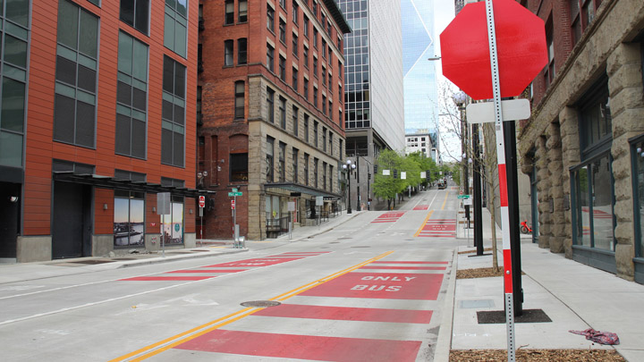  

  

Car traffic across the country has decreased ~40% during the pandemic as people work from home and unemployment rates skyrocket. However, some cities are seeing minimal decrease in air pollution where their dominant sources of pollution include factories, refineries, power plants, and diesel trucks. Efforts for cleaner air must continue.

  

  

  

  

Let's take a break!  
  
Cats love boxes of all shapes and sizes. Cardboard boxes are comforting and provides security. It helps them relieve stress and anxiety. Additionally, boxes are fun. The following is a video two adorable cats and a cardboard box. [Kagami mochi box and Maru&amp;Hana](https://www.youtube.com/watch?v=9YybyJcg44E)  
[@mykreau](https://www.instagram.com/mykreau/)

  

  

  

  

Keep going. Keep growing.  
[@sweetlikedezi](https://www.instagram.com/sweetlikedezi/)

  

  

  

  

Life is tough, but so are you.  
[@sweetlikedezi](https://www.instagram.com/sweetlikedezi/)

  

  

  

  

Nothing changes if nothing changes.  
[@sweetlikedezi](https://www.instagram.com/sweetlikedezi/)

  

  

  

  

[@sweetlikedezi](https://www.instagram.com/sweetlikedezi/)

  

  

  

  

Spring is usually a time to see flowers in bloom. This year, flower festivals and other large public gatherings across the globe were cancelled to limit the spread of COVID-19. In Japan, over a hundred thousand flowers were cut after people continued to visit the fields.  
  
Just north of Seattle, the 300 acres of beautiful tulips in Skagit Valley attracts more than a million visitors every April. Although the Skagit Valley Tulip Festival was cancelled this year, there are virtual tours and other ways to support farmers. 

  

  

  

  

_Leave a word, take a turn._ Markers were set aside for participation. [24 hours later, it was filled with voices from the community.](https://www.instagram.com/p/CBcL7xTg3wd/?utm_source=ig_web_button_share_sheet)  
[@hellafragile](https://www.instagram.com/hellafragile/) [@laurasullivancassidy](https://www.instagram.com/laurasullivancassidy/)

  

  

  

  

George Floyd pleaded these words as a police officer pressed his knee into Floyd's neck.  
  
In 2014, Eric Garner, an unarmed Black man, was killed in a chokehold by New York City Police. "I can't breathe," were his dying words. It has continued through worldwide protests against police brutality and lack of police accountability.

  

  

  

  

Capitol Hill Autonomous Zone (CHAZ) was an occupational protest and self-declared autonomous zone in Capitol Hill. It encompassed six city blocks and Cal Anderson Park surrounding Seattle Police Department�s East Precinct building. It would later be known as the Capitol Hill Occupied Protest (CHOP).

  

  

  

  

_No good cops  
No bad protesters  
No Justice  
No peace  
You are now entering free capital hill_  
  
Prior to the zone�s formation, there were escalating tense interactions between protestors and the Seattle Police Department (SPD). SPD, in full riot gear, used aggressive dispersal tactics on protestors. They used blast balls, flash bangs, pepper spray, and tear gas to control the crowds. 

  

  

  

  

On the night of June 7th 2020, a man drove a car into the crowd and shot a protestor. He walked past the police barricade and toward the police. They didn't fire off any tear gas, flash bombs, or rubber bullets at him even though he just shot a civilian. The victim was treated by protestors until medics arrived.  
  
Later that night, SPD used tear gas to control the protestors despite the mayor�s ban just days prior. They tweeted that the crowd threw rocks, bottles, and fireworks. The next morning the police boarded up and moved out of the East Precinct in an effort to de-escalate the situation. Protesters moved into the zone to begin the occupational protest.

  

  

  

  

"You have the right to remain heard" is an ironic nod to the Miranda rights while not forgetting the excessive use of police force historically against Black Americans. During interactions wherein the victim posed little to no threat to police officers, Black Americans were three times more likely to be shot and killed by the police officers.  
[@mykreau](https://www.instagram.com/mykreau/)

  

  

  

  

Listed are the demands made by CHAZ/CHOP protestors.  
  
<u>The People Demand</u>  
 1. Defund SPD  
 2. Fund Community Health &amp; Safety  
 3. Drop All Charges Against Protestors

  

  

  

  

Defunding the police proposes to reduce and redistribute the police budget towards essential underfunded social services.   
  
"Police budgets continue to be consistent across diverse geographies and cities in the United States, with up to 20% to 45% of discretionary funds allocated to the violent system. All of the police budgets analyzed in the Freedom to Thrive Report have increased since FY17." [(Source: The Center for Popular Democracy)](https://populardemocracy.org/news-and-publications/congress-must-divest-billion-dollar-police-budget-and-invest-public-education)  
  
Crime reduction is difficult without addressing problems stemming from chronic poverty. Homeless shelters, workforce development programs, schools, hospitals, food pantries, and community centers have a significant impact on reducing crime rate and increasing safety. They provide support for people and services in marginalized communities.

  

  

  

  

In this ongoing series of police brutality protests, protestors have been charged with felonies and misdemeanors including violating curfew, trespassing, vandalism, property destruction, theft, and unlawful assembly. An arrest or minor charge can have significant consequences that ripple through a person�s life.  
  
These protestors should be celebrated for their courage and forgiven their civil disobedience--not prosecuted. In 2006, the Rosa Parks Act was passed to clear the arrest records from those considered law-breakers during the Montgomery bus boycott of civil disobedience charges. That boycott resulted in the Supreme Court ruling segregation on public buses unconstitutional. It was a significant step towards civil rights and transit equality.

  

  

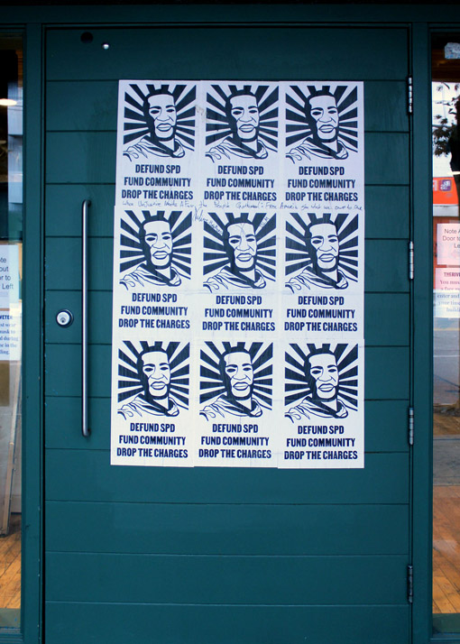  

  

The George Floyd protests started on May 29, 2020 and are ongoing.  
_Updated Dec 12, 2020_

  

  

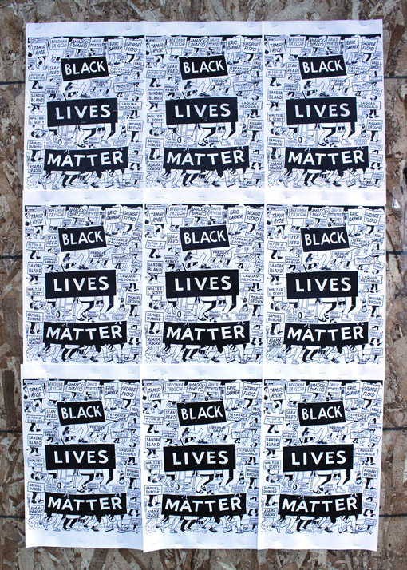  

  

The victims of police brutality are marching in this poster. Their stories are memorialized and continue to be shared. We will march forward on their behalf.  
  
The [print](http://firstandfifteenth.net/blm1.pdf) is available online to download and distribute.   
[Instagram Post](https://www.instagram.com/p/CBBpM28jNw3/?utm_source=ig_embed) by [@steveespopowers](https://www.instagram.com/steveespopowers/?hl=en)

  

  

  

  

"Fuck SPD", "Fuck 12" and "Fuck the Police" were spray painted all across the CHAZ/CHOP zone in response to the excessive use of force by SPD. "Fuck the Police" originates from "Fuck tha Police", a protest song by N.W.A in 1988, that protests police brutality and racial profiling.

  

  

  

  

  

  

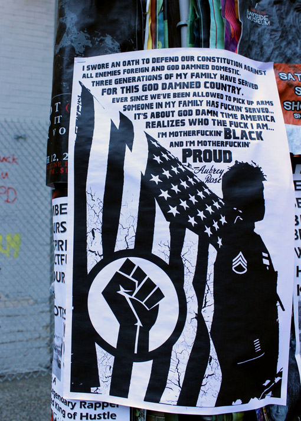  

  

"I swore an oath to defend our constitution against all enemies foreign and God damned domestic. Three generations of my family have served for this god damned county. Ever since we've been allowed to pick up arms someone in my family has fuckin' served... It's about God damn time America realized who the fuck I am... I'm motherfuckin' Black and I'm motherfuckin' proud." quote by Aubrey Rose, a proud Black retired army staff sergeant.

  

  

  

  

The Black power fist salute represents Black pride and solidarity. The BLM movement adopted this symbol after the death of Michael Brown. The unarmed Black teenager was shot dead by police in Missouri in 2014.  

  

  

  

  

Stencil graffiti is an effective technique to quickly spray artwork up and replicate. These artworks are easy to understand because of its simple and straightforward designs. Street artists have used this technique to provide political commentary, protest, and to criticize our society.  
  
These BLM power fist salutes have been sprayed throughout the country on streets, walls, and other surfaces. It interrupts and challenges our everyday spaces. _This is not a moment, it�s a movement._

  

  

  

  

This van is graffitied with raw emotions throughout these BLM protests. There are names of those who have lost their lives. There is the condemnation of the police system. There are words of love. There is hurt.

  

  

  

  

Amanda Gorman uses her poetry and writing as tools for activism. Her work focuses on issues of oppression, feminism, race, and marginalization.   
 During the pandemic, she offers words of hope and understanding. Listen more at [Here &amp; Now](https://www.wbur.org/hereandnow/2020/10/15/amanda-gorman-youth-poet-laureate) from Boston�s NPR News Station (WBUR).   
  
[@amandascgorman](https://www.instagram.com/amandascgorman/?hl=en)

  

  

  

  

<blockquote cite="https://creativeaction.network/products/let-equality-bloom-by-brooke-fischer"><i>Let Equality Bloom</i> was created for the Women�s March on Washington. It was a way to say thank you to all of the women who have fought for our right to vote. We owe them a huge debt of gratitude. They fought so that we are no longer second class citizens and because women�s rights are human rights. This piece was about celebrating the beauty of those women. � Brooke Fischer</blockquote>

  
[brookefischerart](https://www.instagram.com/brookefischerart/) [@creativeactionnetwork](https://www.instagram.com/creativeactionnetwork/)

  

  

  

  

The Pan-African flag is a horizontal triband with red, black, and green stripes. It represents unity among the African diaspora. It is an emblem of Black pride and symbolizes Black liberation. 

  

  

  

  

The killing of George Floyd by the Minneapolis police is part of a long line of incidents of excessive police misconduct with qualified immunity. Qualified immunity is a Supreme Court doctrine that shields government officials from liability for misconduct, even if rights are violated, unless there is a clearly established law from a prior case with the same consequences.  
  
Christopher J. Davis, was shot and killed by a Walworth County deputy who fired into a moving vehicle when deadly force was not appropriate or necessary. The U.S. 7th District Court of Appeals in Chicago decided that the deputy was covered under qualified immunity.

  

  

  

  

This is the memorial made for George Floyd and others who have died in subsequent protests for BLM. There are messages of love, of the change we wish to see, and of memories respecting those who have died. Candles were lit to show solidarity and celebrate the lives of those who have lost theirs.  
  
"Mourn for the dead and fight like hell for the living," is a quote by Mary Harris Jones, a female labor activist who helped establish the Industrial Workers of the World.

  

  

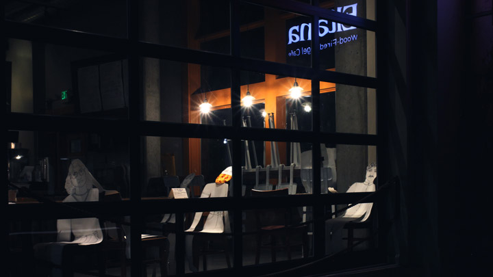  

  

Eltana, a Montreal-style wood-fired bake cafe, was in the heart of CHOP. It is located at the intersection of 12th and Pine directly across the East Precinct of the Seattle Police Department.  
  
They supported CHOP as a step towards systemic change. In the morning, they�d bring out bagels to the No Cop Co-Op, a free food distribution station set up inside of CHOP. They gave half a dozen free bagels to customers if they donated $25+ to any racial justice organization or dined at a Black-owned restaurant in the city with a receipt. Anyone who walked in and said that they�re hungry for justice got a free bagel and spread.  
[@eltanabagels](https://www.instagram.com/eltanabagels/)

  

  

  

  

Local artists collaborated to create a Black Lives Matter Street Mural on East Pine Street between 10th and 11th.   
  
[@vividmattercollective](vividmattercollective)

  

  

  

  

Also check out this [overhead view of the Black Lives Matter street mural.](https://kuow-prod.imgix.net/store/d3d358b1b11dd700b503562ec436094e.jpg?ixlib=rails-2.1.4&amp;fit=crop&amp;crop=edges&amp;w=1280)  
  

  

  

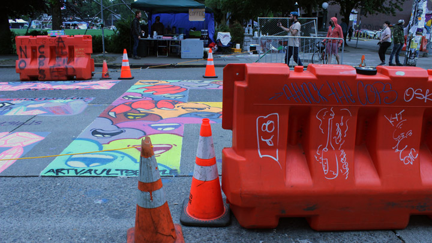  

  

Art Vault is a local non-profit organization that provides free art materials to BIPOC creatives.  
  
[@artvaultseattle](https://www.instagram.com/artvaultseattle/?hl=en)

  

  

  

  

  

  

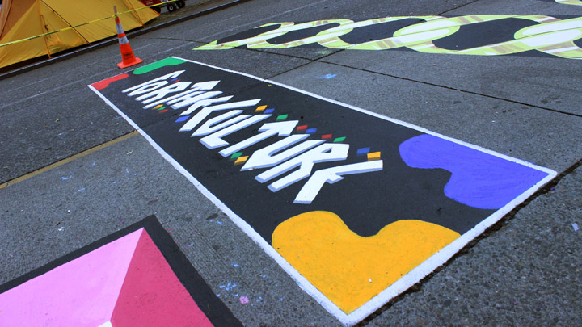  

  

<blockquote cite="https://www.arkcreativecompany.com/for-the-culture/">Black culture deserves to be celebrated and what better way to do that than through game. For The Culture was created to test you on current knowledge but will also allow you to discover facets of the culture you've never encountered before.  � For the Culture 
</blockquote>

  
  
[@forthecultureapp](https://www.instagram.com/forthecultureapp/?hl=en)

  

  

  

  

  

  

  

  

[@thecurlynugget](https://www.instagram.com/thecurlynugget/)

  

  

  

  

Perry Paints is a local painter and songwriter from Tacoma, WA. He uses the power of art to show that people like us are beautiful.  
  
[@perrypaints](https://www.instagram.com/perrypaints/)

  

  

  

  

"You are imperfect, you are wired for struggle, but you are worth of love and belonging." quote by Bren� Brown, author of _Daring Greatly_.

  

  

  

  

The homeless are one of the most susceptible and vulnerable to the pandemic. A high percentage of the homeslessness population are older adults and/or have pre-existing conditions. They have significant barriers to self-care and hygiene. Crowded conditions also ease the spread of airborne infections. Many of the recommendations to prevent COVID are difficult for the homeless to execute.  
  
Homeless shelters are grappling with COVID safety as winter approaches. The homeless population is increasing and has grown by 22% over the last five years. The great need for shelter supasses the limited system resources. To mitigate this effect, some cities have set up emergency shelters in unused public school buildings and hotels.

  

  

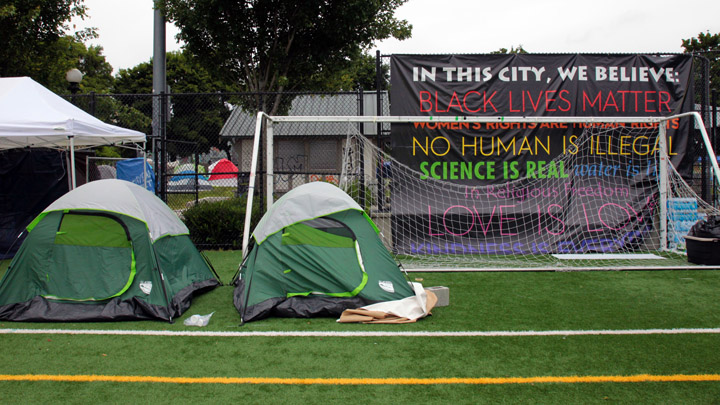  

  

In this city, we believe: Black Lives Matter, women's rights are human rights, no human is illegal, science is real, water is life, in religious freedom, love is love, kindness is everything.

  

  

  

  

Graffiti reflected on the Lincoln Reservoir at Cal Anderson Park during CHAZ/CHOP.

  

  

  

  

"Human rights start with recognizing the importance of every individual. Peace starts from fostering friendship with others." quote by Daisaku Ikeda, a peacebuilding, Buddihist philosopher, educator, author, and poet.  
  
[@therealartsurgeon](https://www.instagram.com/therealartsurgeon/)

  

  

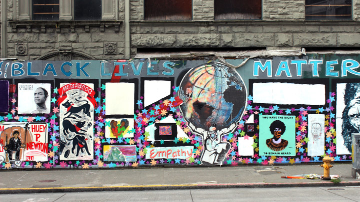  

  

Various artists came together to create this wall of love and solidarity in these trying times. Located at 2nd and Yesler Way.

  

  

  

  

The phrase, "to carry the weight of the world on one�s shoulders," is derived from the Greek Myth wherein Altas, a Titan, bore the weight of the heavens on his shoulders.   
  
Health care workers are experiencing rising levels of burnout, anxiety, and stress. The shortage of Personal Protection Equipment (PPE) puts their patients and themselves at risk. PPE is not intended to be reused. Delayed test turnarounds are preventing the US from effectively containing the virus through the strategy of testing, tracing, and isolating. In addition, protocol changes about COVID-19 were not clearly communicated. 

  

  

  

  

Stay safe love. Love is the way.

  

  

  

  

We are a proud Black woman owned business \#poc \#queerrun \#blm

  

  

  

  

In a celebration of Black voices, the titles in this mural are recommendations of books by Black authors to add to your reading list. _So You Want to Talk About Race_ by Ijeoma Oluo guides readers of all races to have honest conversations about race and racism. I would also recommend _You Belong_ by Sebene Selassie and _The Mindful Athlete_ by George Mumford.  
[@thesetemporarymoments](https://www.instagram.com/thesetemporarymoments/)

  

  

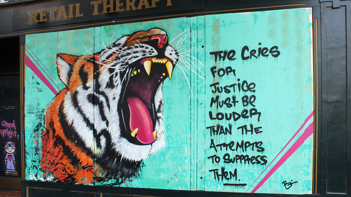  

  

The cries for justice must be louder than the attempts to suppress them.  
  
[@b\_line\_dot](https://www.instagram.com/b_line_dot/)

  

  

  

  

Together, we are strong.

  

  

  

  

Opt for love.

  

  

  

  

Protect our elders. Elders and the immunocompromised are at higher risk for getting severely ill from COVID-19.

  

  

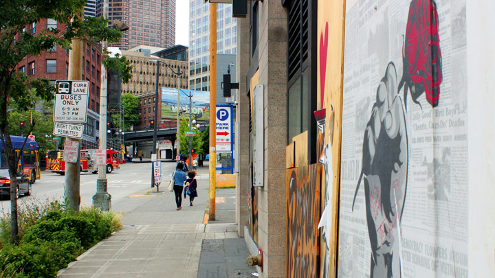  

  

This is 2020   
The bus, the car, the firetruck  
The red stoplight   
The big billboard advertisement with skyscrapers all around  
The mother-daughter pair walking together  
The trees in this urban environment  
The demands for social change painted on plywood  
The news fatigue   
And the raised fist clenching a rose 

  

  

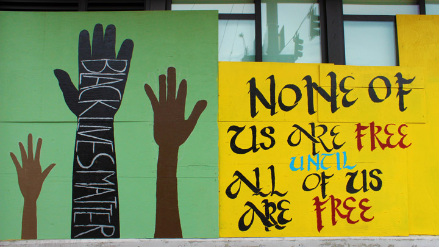  

  

Black Lives Matter  
None of us are free until all of us are free

  

  

  

  

Portraits of generations

  

  

  

  

"It always seems impossible until it's done" quote by Nelson Mandela

  

  

  

  

"Tomorrow's world is yours to build" quote by Yuri Kochiyama

  

  

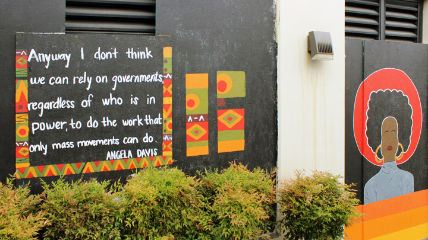  

  

"Anyway I don't think we can rely on governments, regardless of who is in power, to do the work that only mass movements can do." quote by Angela Y. Davis. She is a political activist, educator, and author who advocates for gender equity, prison reform, and alliances across color lines.

  

  

  

  

Listen to [Unwritten Rules by skoodupcam](https://www.tiktok.com/foryou?lang=en#/@skoodupcam/video/6831990586891930886)  

<blockquote cite="" foryou?lang='en#/@skoodupcam/video/6831990586891930886"' https:="" www.tiktok.com="">Jus some unwritten rules my mom makes me follow as a young Black man #fyp #blacklivesmatter � Cameron Welch</blockquote>

  
[@skoodupcam](https://www.tiktok.com/@skoodupcam?lang=en) [@camig.ftp](https://www.instagram.com/camig.ftp)

  

  

  

  

[@\_axsm](https://www.instagram.com/_axsm/)

  

  

  

  

>  "Let nothing dim the light the shines from within" � Maya Angelou  
[@lmfreebird](https://www.instagram.com/lmfreebird/)

  

  

  

  

"Hands up, don't shoot" is a slogan and gesture (hands in the air) that originated after the shooting of Michael Brown in Ferguson, Missouri on August 9, 2014.   
  
The surrounding border are names of Black victims of police brutality that have also sparked outrage. Trayvon Martin, Sandra Bland, Manuel Ellis, Philando Catile, Charleena Lyles, Eric Garner, Bettie Jones, Tamir Rice, Breonna Taylor, and George Floyd.

  

  

  

  

Painted are notable Black female scientists whose work have revolutionized our lives. Katherine Johnson calculated trajectories for the first moon landing. Dr. Gladys West developed models which led to the invention of GPS. Dr. Jane C. Wright revolutionized techniques for chemotherapy.  
  
Hing Hay Coworks

  

  

  

  

"Love can not be broken," an affirmation and reminder that we are loved and are capable of love.  
  
[@let\_it\_be\_made\_8](https://www.instagram.com/let_it_be_made_8/)

  

  

  

  

Fly away with me.

  

  

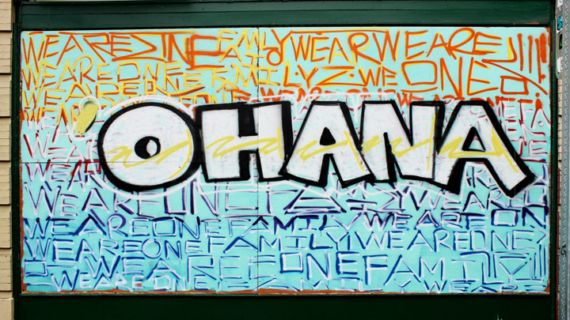  

  

Ohana is a Hawaiian term that means family.

  

  

  

  

Black Lives Matter translated into Chinese, Filipino, Thai, and Korean.

  

  

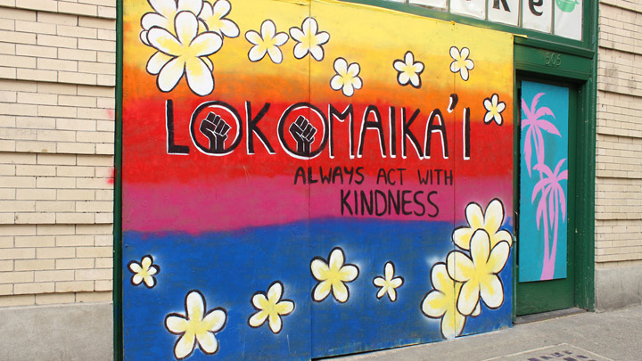  

  

Lokomaika'i: Always act with kindness

  

  

  

  

Amid the pandemic, panic and fear have manifested in deplorable acts of bigotry, racism and xenophobia. Dismantling racism is our collective effort. We must demand real reform and justice.

  

  

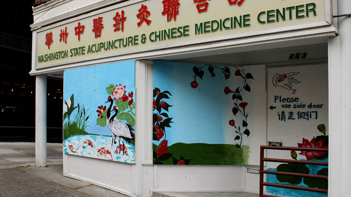  

  

Referring to COVID-19 as the �China virus�, �Wuhan virus�, or the like, promotes othering and stigmatization. The increase in racist rhetoric coincides with increases in racial attacks, violent bullying, threats, racial abuse, and discrimination. It has exacerbated social stigma, national insecurity, and fear of foreigners. COVID-19 is a public health crisis not a racial matter.   
  
By August 2020, the STOP AAPI HATE Reporting Center received over 2,500 reports of incidents of racism, hate speech, discrimination, and physical attacks against Asians and Asian Americans nationwide. Read report releases [here](https://stopaapihate.org/reportsreleases/).

  

  

  

  

Back in March 2020, Jade Garden, a dim sum restaurant in the International District of Seattle, boarded up their windows with plywood after a window was vandalized. It remained open for takeout and delivery. Local artists painted murals to help attract customers and beautify the exterior.

  

  

  

  

Restaurants and other businesses around Seattle looked for help in beautifying their boarded up storefronts. Keoke Silvano, photographer, has been helping to organize other efforts to create mural art for these temporary canvases.  
  
Located at Jade Garden Resturant

  

  

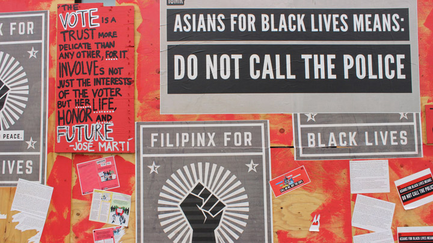  

  

[The Asian American Response to Black Lives Matter Is Part of a Long, Complicated History](https://time.com/5851792/asian-americans-black-solidarity-history/)  
  
[@18millionrising](https://www.instagram.com/18millionrising/)

  

  

  

  

Standing in solidarity with BLM.

  

  

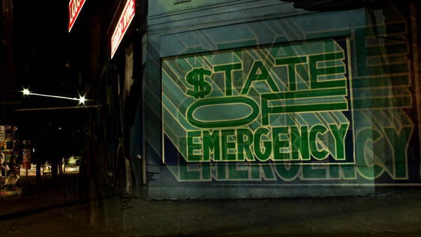  

  

[Ten Percent Happier: Coronavirus Sanity Guide](https://www.tenpercent.com/coronavirussanityguide)  
  
_May we all be happy  
May we all be safe  
May we all be healthy  
May we all live with ease_

  

  

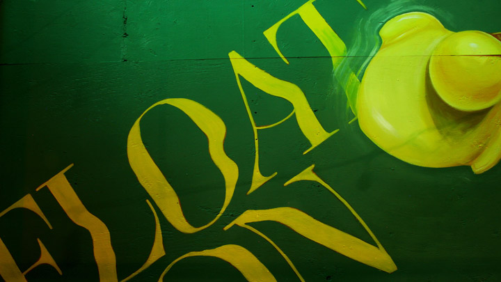  

  

Float on.  
[@thechaoticaquatic](https://www.instagram.com/thechaoticaquatic/)   

  

  

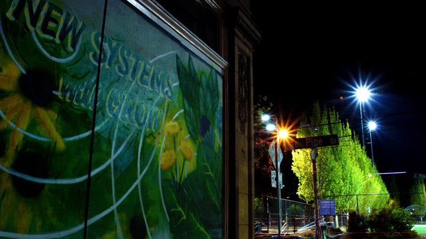  

  

New systems grow...  
[@mari.shibuya](https://www.instagram.com/mari.shibuya/) [@vk.signs](https://www.instagram.com/vk.signs/) [@overallcreative](https://www.instagram.com/overallcreative/)

  

  

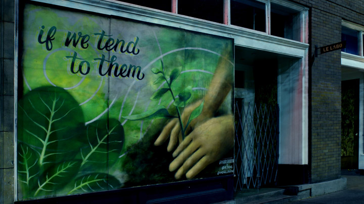  

  

if we tend to them  
[@mari.shibuya](https://www.instagram.com/mari.shibuya/) [@vk.signs](https://www.instagram.com/vk.signs/) [@overallcreative](https://www.instagram.com/overallcreative/)

  

  

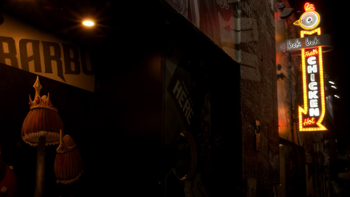  

  

[@bokabokfriedchicken](https://www.instagram.com/bokabokfriedchicken/) [@therunawayseattle](https://www.instagram.com/therunawayseattle/)

  

  