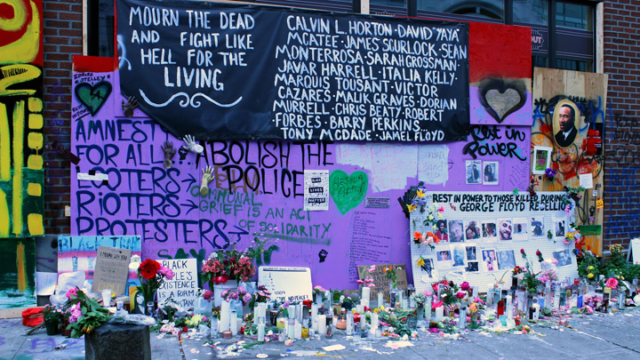

Public art confronts us in our everyday environment. It is a reflection of the times we live in and a critique on our society.

Currently, this project focuses on the events that unfolded in Seattle, WA from the stay at home order through the racial justice protests in 2020. Artists painted across boarded up buildings to express the raw emotions of the community. Their messages throughout the pandemic and the Black Lives Matter movement resonate with us. 

*Nothing is more permanent than the temporary* — A.E. Stallings

<!-- more -->




This is just pure content!




[comment]: <> (<!-- SEPARATOR -->)




This is just pure content!


